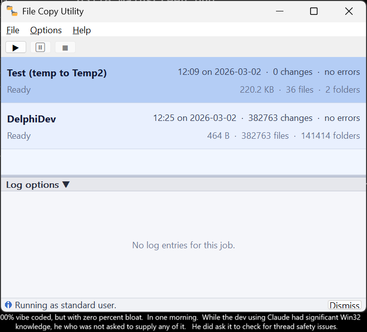

# FileCopyUtility

A Windows desktop file-copy/backup utility written in pure Win32 API + Common Controls —
no MFC, no ATL, no third-party UI libraries.  Static CRT linkage means no runtime
redistribution is needed.



---

## What This Is

A lightweight, self-contained backup tool that copies changed files from one folder to
another.  It compares last-write timestamps and file sizes to skip files that are already
up to date, so only changed files are transferred.

Key characteristics:

- **Pure Win32** — no frameworks, no dependencies beyond the Windows SDK
- **Static CRT** (`/MT` Release, `/MTd` Debug) — single portable EXE, ~320 KB Release
- **Background operation** — runs in the system tray, scheduled backups run automatically
- **Smart defer** — detects when you're actively working and waits until you're done
- **File filters** — include/exclude patterns with folder browse support
- **Live speed display** — MB/s, file counts, ETA during copy
- **Collapsible log view** — per-job timestamped log with expandable sections
- **DPI-aware** — row heights and column widths measured from actual font metrics at runtime;
  scales correctly at 125%, 150%, 200% DPI
- **Multiple jobs** — each job has its own source/destination pair and independent state

Built with Visual Studio 2022, v143 toolset, C++17, targeting x64.

---

## Features

| Feature | Details |
|---------|---------|
| File comparison | Last-write timestamp + size; copies only changed files |
| Live progress | Per-file progress, MB/s speed, file counts, ETA |
| Scheduling | Run every N minutes, or daily at a specific time |
| Smart defer | Uses `ReadDirectoryChangesW` to detect source activity; defers scheduled backups until the source goes quiet |
| System tray | Minimize to tray, balloon notifications on completion/error, Start with Windows |
| File filters | Include/exclude wildcard patterns (`;` or newline separated); browse button to pick folders |
| Pause / Resume | Pause between files; current file copies to completion first |
| Stop | Cancels after the current file; reports elapsed time and error count |
| Log view | Timestamped entries, collapsible groups, live current-file row |
| Symlink safety | Skips symlinks/junctions/reparse points to prevent infinite recursion; logs each skipped item |
| Path validation | Blocks same-folder and overlapping source/dest configurations |
| Job persistence | Jobs and settings saved to INI file; restored on launch |
| DPI scaling | `PerMonitorV2` DPI awareness; no hardcoded pixel sizes |
| Unicode filenames | Uses `W` API variants throughout; handles all valid Windows filenames |
| Long paths | `longPathAware` manifest + `\\?\` prefix for paths beyond 260 chars |
| Settings dialog | Close-to-tray behavior, Start with Windows |

---

## How This Was Built

This project was built in two Claude Code sessions as a demonstration of AI-assisted
development on a real Win32 C++ application.

### Session 1 — The MVP (March 2, 2026)

**Time: 2 hours 13 minutes** (09:39 AM to 11:52 AM, per git timestamps)

Claude produced 3,060 lines of working Win32 C++ from a description of what the app
should do.  The human (Warren) provided the product vision, tested the builds, and
directed the iteration — but wrote zero lines of code.  Every line of C++ was
generated by Claude.

Output: A working desktop app with custom-painted job list, expandable log panel,
background copy engine with pause/stop, INI persistence, and DPI-aware rendering.

At 111,766 characters in 133 minutes, the code appeared at 840 characters per minute —
roughly world-record human typing speed, sustained nonstop, with zero thinking time and
zero errors.  A human physically cannot produce this volume of correct C++ in this
timeframe.

### Session 2 — Feature Complete (March 26, 2026)

**Time: ~2 hours** (including design review via gstack /office-hours)

Added 1,100+ lines across 18 files: system tray, scheduling, speed display, file
filters with browse-to-folder, smart defer via ReadDirectoryChangesW, FolderWatcher,
Settings dialog, symlink safety, path validation, UI polish, and 16 unit tests.

The human's contribution in Session 2 was product thinking: "Should it launch to tray
at startup?", "What about symlinks causing recursion?", "Warn about skipped
symlinks — we're nice people", "What about same-folder copies?", and the smart defer
concept (defer backups while the source is actively changing).

### The Numbers

| Metric | Value |
|--------|-------|
| Total wall-clock development time | ~5 hours across 3 sessions |
| Total lines of code (v2.0) | 4,169 |
| Lines of tests | 211 |
| Release EXE size | 320 KB |
| Industry baseline (solo C++ dev) | 50-68 LOC/day (Brice, 2017) |
| Industry time for 4,169 LOC | 61-83 working days |
| **Measured speedup** | **10x+ (conservative)** |

The 10x claim is conservative.  Industry data from McConnell (Code Complete),
Capers Jones, and real-world solo C++ developers converges on 15-68 delivered
lines per day for this kind of work.  At the midpoint, v2.0 would take ~100
working days solo.  We did it in parts of 3 calendar days.

Sources: McConnell, Code Complete 2nd Ed. Section 27.4; Capers Jones, Applied
Software Measurement 3rd Ed.; Andy Brice, successfulsoftware.net (2017, 12-year
solo C++ data).

### What the Human Contributed

- Product vision and every architectural decision
- Real-time quality feedback and testing
- Safety thinking (symlinks, path overlap, filter logic on directories)
- The smart defer concept
- The narrative ("everyone's a developer now")
- Domain expertise as a quality filter on AI output
- Zero lines of code

### What Claude Contributed

- All 4,169 lines of C++
- All Win32 API integration (GDI, shell, COM, threading, overlapped I/O)
- The copy engine architecture
- All custom UI painting
- All 16 unit tests
- The Inno Setup installer script

---

## Building

### Requirements

- Visual Studio 2022 (Community or higher) with the **Desktop development with C++** workload
- Inno Setup 6 (only needed to build the installer)

### From Git Bash

Git Bash mangles MSBuild flags like `/p:` into Unix paths.  Prefix the command with
`MSYS_NO_PATHCONV=1` to prevent this:

```bash
MSYS_NO_PATHCONV=1 "/c/Program Files/Microsoft Visual Studio/2022/Community/MSBuild/Current/Bin/MSBuild.exe" \
    FileCopyUtility.vcxproj /p:Configuration=Release /p:Platform=x64 /m /nologo /v:minimal
```

Or open `FileCopyUtility.sln` in Visual Studio and build normally.

### Build Installer

After building, create a distributable setup EXE with:

```cmd
build-installer.cmd
```

This will:

1. Build `Release|x64`
2. Compile `installer\FileCopyUtility.iss` using Inno Setup (`ISCC.exe`)
3. Write the installer to `installers\`

If Inno Setup is not installed, get it from [jrsoftware.org](https://jrsoftware.org/isdl.php).

### Run Tests

```cmd
cd tests
build_tests.cmd
```

16 unit tests covering filter matching, path conversion, timestamp format,
speed/ETA calculation, and schedule logic.

### Create Source ZIP

```powershell
.\create-source-zip.ps1
```

### Output

| Configuration | EXE location |
|---------------|-------------|
| Debug x64 | `bin\Debug_x64\FileCopyUtility.exe` |
| Release x64 | `bin\Release_x64\FileCopyUtility.exe` |

---

## Project Structure

```
FileCopyUtility/
├── main.cpp              Entry point, --minimized flag, message loop
├── MainWindow.h/cpp      Frame window: toolbar, tray, scheduling, splitter
├── JobListPanel.h/cpp    Custom-painted job card list with speed/ETA display
├── LogPanel.h/cpp        Custom-painted expandable log tree
├── CopyEngine.h/cpp      Background copy thread with filters and symlink safety
├── CopyJob.h             Data types: JobStatus, ScheduleType, LogEntry, JobStats
├── AddJobDlg.h/cpp       Add/Edit job dialog with schedule, filters, browse
├── FolderWatcher.h/cpp   ReadDirectoryChangesW wrapper for smart defer
├── utils.h               Shared utilities: TimestampNow, SplitPatterns
├── logger.h/logger.c     Thread-safe debug/file logger
├── resource.h            All resource, message, timer, and tray IDs
├── resources.rc          Menus, dialogs (Add Job, Settings), VERSIONINFO
├── FileCopyUtility.manifest  ComCtl v6 + PerMonitorV2 + longPathAware
├── FileCopyUtility.vcxproj
└── tests/
    └── test_main.cpp     16 unit tests (no external dependencies)
```


## Download link

Browse to the Actions tab of this GitHub repo, or go to the Wiki page:

https://github.com/wpostma/VibeCodedFileCopyForWindows/wiki